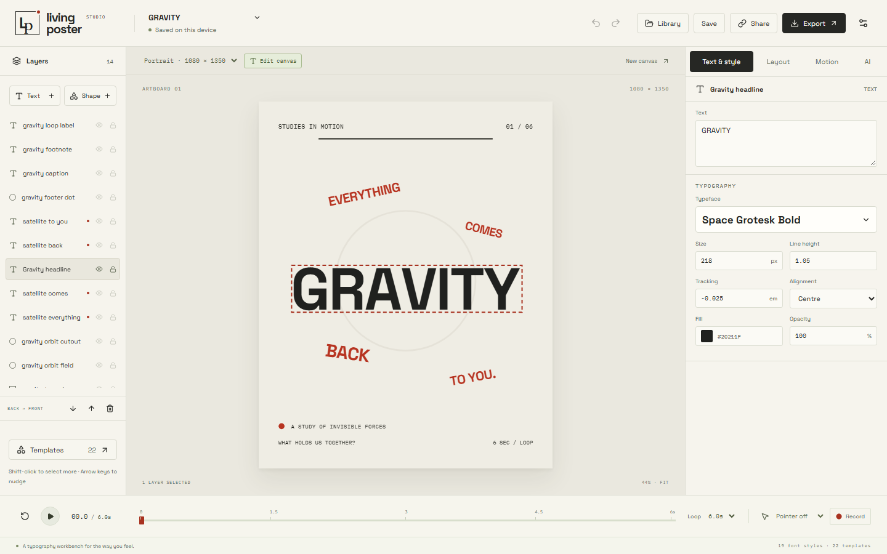

# Living Poster

A typography instrument where words float, orbit, ripple, scatter, pulse, swing, bounce, reveal, and respond to your pointer.

**[Open the live studio](https://living-poster.vercel.app)** · [Public GitHub repository](https://github.com/Chi944/living-poster)



[Watch the original 60-second demo](docs/assets/living-poster-demo.mp4) · [Explore 22 editable templates](tests/core-artifacts/gallery.png)

[Preview the font library](docs/assets/font-library.png) · [See the template browser](docs/assets/templates.png)

Version 1.2 adds 19 font styles across 10 free families, 22 templates, and a compact editor organized into **Text & style**, **Layout**, **Motion**, and **AI** tabs. Search fonts and templates directly; on small screens, switch between **Canvas**, **Layers**, and **Tools** instead of scrolling through the whole studio.

Living Poster runs in your browser on free static hosting, or as a local application on your computer. The editor, projects, revision history, read-only presentations, PNG exports, self-contained HTML exports, and local AI editing require **no subscription, API key, paid service, or usage credits**. AI uses Ollama with a locally installed model. There is no cloud model fallback.

## Browser edition on Vercel

The Vercel build is a static website: `npm run build:hosted` produces `dist/hosted`. It uses no server functions, managed database, paid model, analytics service, or API secret. `vercel.json` configures the build and presentation routes. The linked project uses the free Hobby plan.

**There is no password in the browser edition.** Projects and immutable revisions stay in IndexedDB in your browser profile. Clearing site data removes the library. Download scene JSON files for backups or to move between devices; browser storage is not cloud account sync.

Sharing creates an immutable compressed snapshot inside a URL fragment. A recipient can open that link on another device without your browser running. The fragment contains the poster and is not sent to the Vercel server. Anyone with the full link can read it; removing an entry from your library cannot revoke copies. Animated HTML export is another portable, fully offline option.

Manual tools and exports work immediately. **Studio settings → Connect local Ollama** enables real AI on your own computer after explicit connection. Follow the displayed `OLLAMA_ORIGINS` instructions and allow local-network access if your browser asks. Browser restrictions or unavailable local hardware can prevent that connection; the local edition below runs the same model through its Node server. See [hosting and local AI setup](docs/hosting.md).

## Run it

Requirements: Node.js 24 or newer and npm. For AI editing, install [Ollama](https://ollama.com/download) and download the free local model:

```sh
ollama pull qwen3:4b
npm ci
npm run build
npm start
```

Open **http://127.0.0.1:4317**. Choose a starting poster and start editing. Use **Save** to create your local owner password; the same password protects projects, history, shares, and AI requests on this installation. It is stored as a salted hash, never in exported posters or source code.

Qwen3 4B takes approximately 2.5 GB of download space. A compatible GPU makes local edits faster; the application also supports CPU inference. Manual editing and exports work without Ollama. The interface explains when the local model is unavailable instead of substituting canned AI responses.

During development:

```sh
npm run dev
```

Open http://127.0.0.1:5175. The API runs on port 4317. The checked-in fonts are available immediately; run `npm run build` once to generate the standalone player required by animated HTML export. On Windows, `powershell -ExecutionPolicy Bypass -File scripts/start.ps1` also installs missing dependencies, builds, and starts the production application.

## Make a poster

1. Choose **New canvas** for a blank portrait, square, story or landscape canvas, or browse 22 templates. Search by name, mood or occasion, filter by format or category, and use the six-card pages. The artboard format selector proportionately fits an existing composition to another format.
2. Select a layer and use **Text & style** for wording, typeface, color and size. The typeface picker previews your words, searches family names, and filters font styles. Wider type is reduced in size when needed to fit the canvas; **Undo** restores the previous font and size together. Double-click canvas text to open its editing field directly.
3. Use **Layout** for position and rotation. Click or Shift-click layers on the canvas or layer list, drag to position them, or use arrow keys for 1-unit nudges and Shift+arrow for 10.
4. In **Motion**, try twelve animation recipes or combine ten individual motion types. Tune parameters and scrub the timeline. Click an animated layer or use **Edit canvas** to freeze the frame and edit. Changes affect base layout independently of the animation.
5. Open **AI** to describe a change through your local model. Valid edits apply as one undoable operation and highlight affected layers. Material ambiguity asks for clarification; unsupported requests explain an alternative.
6. Save revisions, share a read-only snapshot, or download a PNG, scene JSON, or animated HTML file.

On a phone or narrow window, use the **Canvas**, **Layers**, and **Tools** view buttons. Choosing or adding a layer opens its tools; playback returns to the canvas. The editing tabs stay together, so changing tasks does not require scrolling past unrelated controls.

Ctrl/Cmd+Z undoes manual and AI edits. Ctrl/Cmd+Shift+Z redoes. Delete removes the selected layer outside text fields. Escape cancels an unfinished drag or recording. **Cancel recording**, pausing playback, or editing a property also exits recording safely. Invalid field edits revert to the last valid value and can be corrected immediately. Interface controls are keyboard-accessible; reduced-motion preferences start playback paused.

## What is local, and what is shareable?

In the native local edition, browser recovery uses IndexedDB. Persistent projects, revisions, password/session hashes, private instructions, and share snapshots use `data/living-poster.sqlite`. The entire `data/` directory is Git-ignored. Back it up to preserve your installation; stop the server before copying it, or use SQLite's supported backup tooling. The browser edition uses the different persistence and sharing rules described above.

A share URL points to an immutable read-only snapshot served by **your running server**. A localhost link works on your own computer. For another person to open it, your server must be reachable from their device. This application does not silently upload posters or provision paid hosting. For effortless sharing without running a server, send the downloaded HTML file: it includes its renderer and fonts and opens offline.

For deliberate LAN hosting, set `LP_HOST=0.0.0.0` and `LP_PUBLIC_HOST` to the computer's LAN IP or hostname. Complete owner setup on localhost first. Restart the server, then open the configured address at port 4317. Keep authoring access protected by your password. Use the static browser build for Vercel; the native SQLite server is intended for localhost or explicitly configured LAN access.

Revoking a share prevents future requests to that URL. It cannot retract a file someone already downloaded.

## Configuration

Copy `.env.example` to `.env` and edit it when needed. The default setup needs no environment file.

| Variable         | Default                  | Purpose                                                         |
| ---------------- | ------------------------ | --------------------------------------------------------------- |
| `PORT`           | `4317`                   | Local application port                                          |
| `LP_HOST`        | `127.0.0.1`              | Server bind address                                             |
| `LP_PUBLIC_HOST` | unset                    | One explicitly allowed LAN/reverse-proxy hostname, without port |
| `LP_DATA_DIR`    | `./data`                 | SQLite data directory                                           |
| `OLLAMA_URL`     | `http://127.0.0.1:11434` | Loopback Ollama origin; remote endpoints are rejected           |
| `OLLAMA_MODEL`   | `qwen3:4b`               | Installed local model; cloud-backed models are rejected         |

Do not put passwords, databases, or session cookies in Git. `.env` and local data are excluded. There is no OpenAI, Supabase, or paid generation SDK in the application.

## Verify

```sh
npm run typecheck
npm test
npm run build
npx playwright install chromium
npm run test:e2e
npm run build:hosted
npm run test:hosted
npm run eval:local
npm run bench
```

The unit/integration suites use controlled test adapters for transport failures and race conditions; the live evaluation command uses your actual local Ollama model. No test invokes a paid API. Browser tests use a fresh isolated data directory. See [evaluation results](docs/evaluation.md) for actual measurements and the separate human-review status.

## Release boundaries

- Four artboard formats: portrait 1080×1350, square 1080×1080, story 1080×1920, and landscape 1920×1080. A 2–10 second looping timeline, text and rectangle/ellipse layers.
- Nineteen bundled font faces from Space Grotesk, Fraunces, IBM Plex Mono, DM Sans, Playfair Display, Libre Baskerville, Barlow Condensed, Archivo Black, Caveat, and Nunito Sans. All have regular and bold styles except Archivo Black, which has one style. Font licenses and exact asset hashes live in `apps/web/public/fonts`.
- New revisions use renderer 1.2.0. Existing 1.0.0 and 1.1.0 posters remain readable with their original six font faces; those font binaries are unchanged. The expanded font library requires renderer 1.2.0.
- Supported Latin typography, explicit line breaks and a consistent per-letter layout. Complex-script shaping, cross-letter ligatures and custom fonts are outside this release.
- Bounded procedural motion, not a physics simulation. Motion can be constrained near artboard edges.
- Replay is deterministic with the same renderer, fonts, scene, time, and recorded/fixed pointer input. Live pointer movement is explicitly an input. OS/browser antialiasing can differ.
- PNG and animated HTML export are included. Video export is a future enhancement; the portfolio demo is a screen recording of the application.

Normal installs and builds need no Python. The build verifies every installed font against the frozen SHA-256 manifest before copying assets. Maintainers adding reviewed fonts can regenerate exact hashes and Unicode cmap coverage with `python scripts/generate-font-manifest.py` using the free fontTools and Brotli packages, then run `node scripts/assets.mjs`. Existing font IDs must retain their shipped bytes for old posters to replay consistently.

## Design and engineering

- [Scene format and motion rules](docs/scene-format.md)
- [Architecture and reliability](docs/architecture.md)
- [Vercel hosting and optional local AI](docs/hosting.md)
- [Evaluation and performance](docs/evaluation.md)
- [Portfolio case study](docs/case-study.md)
- [60-second demo](docs/demo-script.md)
- [Original plan](docs/superpowers/plans/2026-09-13-living-poster.md), superseded where necessary by the [free local implementation contract](docs/build-contract.md)

## License

Application code: MIT. Bundled fonts retain their SIL Open Font License notices. Ollama and model weights are obtained separately under their own licenses; Qwen3's selected model is published with Apache 2.0 license material. No model weights or user data are committed to this repository.
