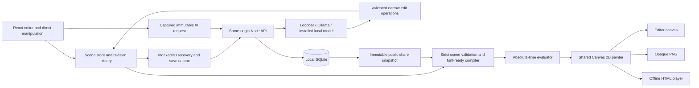

# Architecture and reliability

Living Poster 1.2 provides browser and local editions with one shared scene engine. React provides the editor and Canvas 2D draws the poster. The local edition's Node 24 service owns SQLite persistence, session authentication, and requests to a locally installed Ollama model. There are no paid APIs, cloud database dependencies, generated JavaScript, or remote model fallbacks.

The static browser edition for Vercel was introduced in 1.1. `VITE_HOSTED=true` is set only by `build:hosted`; `api.ts` then dispatches to `hosted-api.ts`. That adapter provides transactional IndexedDB project/revision storage, operation idempotency and compare-and-swap saves. Native builds retain the Node/SQLite API. No Node server bundle or paid service is deployed with the browser edition.

Hosted sharing serializes a validated scene and title into a compressed URL fragment. Decoding bounds compressed input and decompressed output to prevent excessive allocation. Fragments never contain the private library, session information or prompt history. Link removal is explicitly local list removal, because distributed snapshot links cannot be revoked.

The browser model adapter requires an explicit Connect action for each page session before any loopback request. It uses the same real Ollama provider and validated scene operations as the server. A Web Lock coordinates inference across tabs, and one IndexedDB transaction commits each state mutation. Recovery takes that same lock before marking abandoned requests indeterminate. Disconnect invalidates in-flight connection checks and pending admission. Queued inputs and outcomes persist; interrupted requests are never automatically retried.

Editing transitions centrally stop recording and freeze time/pointer input. Selection, property focus, undo/redo, playback pause and Escape all leave the canvas editable. Pointer-mode changes invalidate frozen input. Direct drags preserve point anchors and use the selected ink bounds to constrain movement within the artboard.

The 1.2 editor separates **Text & style**, **Layout**, **Motion**, and **AI** into four tool tabs. Hidden panels retain pending component state, including the AI composer, while keyboard tab navigation reaches only the active controls. Double-clicking text selects its style panel and focuses the wording field. On narrow screens, **Canvas**, **Layers**, and **Tools** select one workspace view at a time; choosing a layer opens its tools, and playback returns to the canvas.

The template browser searches 22 compositions by title, description and tags, filters by format/category, and displays six cards per page. The font picker previews the selected text across 19 faces from 10 bundled free families, with search and category filters. A font change uses actual geometry to reduce the selected layer's size only when needed. That fit and font change form one undoable command, preserving wording, position and motion.

The following diagram shows the native edition's persistence and model path:

## Source boundaries

| Area                | Source                                                                 | Responsibility                                                                                                                                |
| ------------------- | ---------------------------------------------------------------------- | --------------------------------------------------------------------------------------------------------------------------------------------- |
| Scene engine        | `packages/core/src`                                                    | Closed scene language, atomic operations, 19-face font coverage/hashes, typography, pointer replay, motion evaluation, painting, 22 templates |
| Editor              | `apps/web/src/store.ts`, inspector, canvas, timeline, composer         | Selection, gestures, playback, pending fields, undo/redo, stale-result gates                                                                  |
| Creative browsers   | `apps/web/src/FontPicker.tsx`, `font-choice.ts`, `TemplateBrowser.tsx` | Searchable font previews and geometry fitting; filtered, paginated template selection                                                         |
| Browser durability  | `apps/web/src/drafts.ts` and store outbox                              | IndexedDB transactions, draft recovery, queued immutable save snapshots                                                                       |
| Hosted persistence  | `apps/web/src/hosted-api.ts`                                           | Browser project/revision transactions, immutable fragment shares, explicit local model connection                                             |
| HTTP service        | `apps/api/src/server.ts`                                               | Same-origin/auth boundaries, owner-scoped routes, idempotency, queue admission, public snapshot DTOs                                          |
| Database            | `apps/api/src/db.ts`                                                   | SQLite schema, transactions, startup job-state reconciliation                                                                                 |
| Local model adapter | `apps/api/src/provider.ts`                                             | Installed-model checks, bounded structured requests, intent validation and translation                                                        |
| Export              | `apps/web/src/exports.ts`, `player.ts`                                 | Frozen scene exports, embedded trusted player, font bytes and licenses                                                                        |
| Build               | `scripts/build.mjs`, `scripts/assets.mjs`                              | Vite editor, standalone IIFE player, Node server bundle, bundled font preparation                                                             |

The core imports no React, database, network model client, or server authentication code. Font loading is the core's explicit browser I/O boundary; `evaluateScene` itself reads no DOM, clock, mutable random seed, or network state. The API uses structural/semantic validation without introducing a different font rasterizer.

## Scene, revision, and transient state

A scene snapshot is independent from conversation history. Base layout, typography, behaviors, seed, duration, and repeatable pointer input live in the scene. Selection, playhead, live pointer, request status, active gestures, and saved-project identity belong to editor state.

Every accepted command creates a new revision identity. Undo, redo, and restoration create fresh revisions even when they restore old content. A gesture starts from a captured base scene, updates positions relative to that capture, and produces one history entry when completed. Cancelling restores the capture and leaves no completed command.

Current revisions use renderer 1.2.0. Readers accept 1.0.0 and 1.1.0 scenes with their original six font faces, whose exact binaries are unchanged. A new font reference requires 1.2.0. Narrow typography operations add missing font references atomically and validate actual character coverage; they cannot mutate the input scene when a proposed font is rejected.

Async AI requests capture document identity, scene revision, request generation, and mutation epoch. Gesture start and pending property-field entry invalidate earlier requests before a completed revision exists. Application is guarded by matching all captured identities and by the absence of an active gesture or pointer recording. Returning to old content through Undo does not restore eligibility for an old response.

The model does not replace the scene. It proposes a closed intent envelope, which the server translates into narrow operations. Both server and browser validate operations and the resulting scene; browser font geometry is a separate required acceptance boundary. Wording changes require the captured permission flag and an exact old-text precondition. Unmentioned fields remain unchanged by the operation implementation. An invalid batch applies nothing.

## Model execution

The default model is configured in the server and `.env.example`; it is a locally installed Ollama model. The adapter permits only HTTP loopback origins, refuses redirects, and rejects reported cloud-backed models. It calls `/api/tags` for availability, `/api/show` for model metadata, and `/api/chat` for structured output. Poster text is included as data, never executed as instructions or code by the application.

The server accepts requests only for authenticated sessions. It validates selected IDs and base revision against the submitted scene, persists the full immutable input, and deduplicates by `(owner_id, request_id)`. Reusing an ID with different content returns a conflict. Availability checks introduce an async boundary, so the route repeats deduplication and capacity checks immediately before insertion.

One local model request runs at a time, with at most eight admitted queued/running requests by default and a 120-second job timeout. Structured output is limited to a JSON schema and a bounded prediction count. Input messages have a conservative byte budget to avoid silently truncating scene identifiers in the local context. Oversized requests fail with an explanation; there is no paid or larger remote fallback.

The durable ledger stores input, status, result/error, model, latency, token counts, and disposition. Cost is zero for local inference. Transport states are `queued`, `running`, `completed`, `failed`, and `indeterminate`; completed results separately carry `edit`, `clarify`, or `unsupported`. A completed proposal can be marked `applied` or `superseded` without changing the scene stored in the request.

There is no automatic model retry. On server startup, pending/running records are marked indeterminate rather than silently dispatched again. A new explicit request is required. This is a conservative implementation boundary: the ledger survives restart, but the current service does not resume the old in-memory queue.

## Local persistence and save integrity

SQLite stores owners, session hashes, projects, immutable revisions, operation acknowledgements, share snapshots, and AI requests. Its data directory is excluded from Git. WAL mode, foreign keys, and a busy timeout are enabled. Domain mutations that need atomicity run in `BEGIN IMMEDIATE` transactions.

A project save includes a client operation ID and expected saved head. In one transaction, the API:

1. Finds an existing acknowledgement by `(owner_id, operation_id)` and compares the canonical payload hash.
2. Confirms the authenticated owner can access the project.
3. Compares its head to `expectedHeadRevisionId`.
4. Inserts a fresh immutable revision and advances the head.
5. Stores the response used for future duplicate acknowledgements.

The hash is not part of the uniqueness key. An identical retry returns the prior response; different content under the same operation ID fails. A stale head returns HTTP 409, preserving the competing server revision instead of overwriting it.

The browser outbox captures immutable snapshots and sends them in order. Acknowledgements update synchronization metadata for their captured document; they must not replace a newer editing scene. Conflict recovery keeps a local draft and supports saving a separate project. IndexedDB serializes writes through a promise chain and stores each snapshot in a transaction. Storage failures remain visible rather than being represented as successful persistence.

Browser IndexedDB and server SQLite serve different purposes. Device recovery is specific to the browser profile. SQLite is the durable local library shared by authenticated sessions. Back up the data directory using a consistent SQLite backup procedure; copying a live WAL database as a single file is not sufficient.

## Authentication and shares

An installation has one local owner. Initial password setup is accepted only from the loopback address and a loopback Host header. Passwords use salted scrypt hashes. Session tokens contain 32 random bytes; only their SHA-256 hashes are stored. Cookies are HttpOnly and SameSite Strict, with a seven-day lifetime; HTTPS requests receive Secure cookies. Login attempts are rate limited.

Mutation requests require the same origin and JSON content types where applicable. Cross-site fetches are rejected. Host validation restricts requests to loopback hostnames or the explicitly configured public hostname, limiting DNS-rebinding access to the local server. The default bind address is `127.0.0.1`; publishing a LAN address is a deliberate configuration change.

Private project, revision, AI-history, and share-management queries are scoped by the authenticated owner. There is no browser-accessible direct database API and no client-supplied owner ID. SQL values use prepared statement parameters. Operational errors avoid exposing SQL details and credentials.

A share captures one saved revision's scene and title. The public presentation route returns only `{ scene, title }`; it does not return project history, instructions, authentication material, or private request results. Random share tokens are looked up by hash. The owner can revoke a link; subsequent requests then return not found. Later authoring revisions do not alter an existing snapshot. Revocation cannot retract an already downloaded file or an already loaded browser copy.

## Rendering and export

The compiler resolves loaded fonts and per-grapheme ink geometry once per scene revision. The evaluator computes a frame directly from absolute time and pointer input. No simulation history is needed to seek, restart, or export a selected frame. The painter fills the solid background, uses the same unit transforms everywhere, and clips to the artboard.

All 19 font faces are self-hosted WOFF2 assets with bundled OFL notices. The frozen manifest records SHA-256 and actual Unicode cmap coverage. Asset preparation validates every installed file before copying it, so package updates cannot silently change an old font ID. Normal builds require no Python; the optional `scripts/generate-font-manifest.py` maintenance command uses fontTools and Brotli to generate a reviewed manifest from the actual binaries.

PNG export captures a revision, selected time, and repeatable/frozen pointer input, draws into an isolated canvas, and produces an opaque image. HTML export embeds the trusted built player, safely encoded scene JSON, required font bytes, and license text. It includes no API client, session, request history, or model SDK. Embedded scene text is rendered through Canvas or `textContent`; markup-looking poster copy remains inert. Reduced-motion preferences start presentations paused.

Determinism applies to evaluated transforms for the same scene, renderer/font build, time, and pointer input. Physical text rasterization can vary across browsers and operating systems. Live pointer movements are additional inputs, not a reproducible scene property unless captured or frozen.

## Verification and diagnostics

Unit tests exercise scene limits, invalid references, exact loop endpoints, random-order seeking, bounded transforms, pointer-center continuity, pointer seams, font failures, atomic command preservation, and fresh revision identity. API tests use real temporary SQLite databases and controlled local-model adapters for failure/race scenarios. Browser tests cover the actual fonts and shared export player.

`node tests/core-browser-probe.mjs` generates a 22-poster contact sheet and evaluates multiple loop times with actual bundled fonts. Its 1.2 run validates all 22 templates in four formats, for 88 variants, with exact loop endpoints and zero bounds corrections at the sampled times. Browser export tests compare five exact evaluated frames for each of the 22 templates and check all 19 embedded font faces offline.

The current `node tests/performance.mjs` loads all 19 bundled faces and benchmarks all 22 templates plus two stress fixtures, respecting each scene's actual artboard size. Its 24-case functional smoke run passed. Defaults remain 1.8 seconds of warm-up and 30 seconds of sampling per case. `LP_BENCH_SECONDS` and `LP_BENCH_WARMUP_MS` change those durations; `LP_BENCH_OUTPUT` keeps a new report separate from retained historical results. A short smoke run is not a substitute for the full-duration timing comparison.

The timing results below are the historical original-release run, covering six compositions plus a 24-layer/400-grapheme/60-behavior typical fixture and a 64-layer/1,024-grapheme/256-behavior limit fixture. That run warmed each case for 1.8 seconds and sampled it for 30 seconds. The report records evaluation, painting-command submission, combined cost, rAF callback intervals, draw count, bounds corrections, browser version, DPR, and graphics renderer in `tests/core-artifacts/performance.json`. These timings do not measure the expanded 1.2 template library or redesigned editor.

That historical benchmark used headless Chromium and an isolated fulfilled localhost page with networking disabled. Canvas CSS size was 540×675 at DPR 2, with 1080×1350 backing pixels. It measured the scene engine, excluding React editor chrome. Its rAF measurements were callback intervals, not physical display presentation timing. Other processes were not stopped, so results can reflect concurrent machine load. The benchmark's `--assert` flag makes measured target misses return a failing exit code. Performance results do not imply that unrun accessibility, live-model interpretation, or human visual-review gates passed.

Recorded run: Chromium 153.0.8010.12, Windows 11, Intel i5-12400, 32 GiB RAM, SwiftShader renderer. Each case has approximately 1,800 measured frames after warm-up. Synthetic typography uses 14-unit text in the typical fixture and 12-unit text in the limit fixture; the six example cases retain their actual varied typography.

| Case                                        | Evaluation + paint p95 | rAF callback interval p95 |
| ------------------------------------------- | ---------------------: | ------------------------: |
| Six original-release compositions           |             0.6–0.8 ms |              16.7–16.8 ms |
| 24 layers / 400 graphemes / 60 behaviors    |                 1.9 ms |                   16.7 ms |
| 64 layers / 1,024 graphemes / 256 behaviors |                 4.5 ms |                   16.7 ms |

All cases met their measured engine timing targets in this run. Full percentiles, sample counts, maximum intervals, draw counts, and bounds-correction totals are in [the machine-readable results](../tests/core-artifacts/performance.json). This is evidence for this browser/fixture configuration, not a guarantee for every computer or poster.
