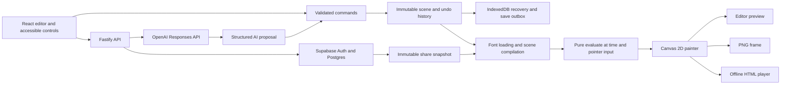

# Living Poster Implementation Plan

> **For agentic workers:** REQUIRED SUB-SKILL: Use superpowers:subagent-driven-development (recommended) or superpowers:executing-plans to implement this plan task-by-task. Steps use checkbox (`- [ ]`) syntax for tracking.

**Goal:** Build a polished creative instrument in which people combine direct typography editing and natural-language instructions to make, revise, save, and export animated posters.

**Architecture:** A React editor sends validated commands to an immutable scene store. A shared TypeScript evaluator and Canvas 2D painter power the editor, read-only shares, PNG export, and self-contained HTML presentations. A small Node API owns model calls, authorization, request deduplication, and transactional revision persistence.

**Tech Stack:** TypeScript; Vite + React; CSS modules and accessible native controls; Zustand for editor subscriptions; Zod; Canvas 2D; IndexedDB via idb; Fastify; Supabase Auth/Postgres; official OpenAI Node SDK; Vitest + fast-check; Playwright + axe-core.

**Spec:** [Original product brief](../../product-brief.md).

**Status:** Historical planning document, prepared 13 September 2026. The user subsequently authorized implementation in `active/living-poster` with entirely free features. The [free local implementation contract](../../build-contract.md) supersedes hosted Supabase/OpenAI choices and planning-only restrictions below: the application uses local SQLite, local password authentication, and local Ollama. Consult the README and current architecture/evaluation documents for the implemented release.

## Global constraints

- “Build entirely from scratch in a new project. Do not reuse or modify my existing projects.”
- “Target a polished first release achievable in roughly 1–2 weeks.”
- “Do not implement during this planning turn.”
- “Use procedural graphics. External image or video generation is not required for the first release.”
- “Do not execute arbitrary generated JavaScript, CSS, shaders, or HTML.”
- “Use one authoritative scene evaluator for preview and export.”
- “Keep scene files independent from conversational history.”
- “Add video export only after the core workflow is complete and tested.”

All values below are proposed release defaults, not measurements of an application that already exists.

## 1. Environment and release boundaries

The new project directory is `C:\Users\User\Documents\Projects\living-poster`, separate from all existing project folders under `active`. Initialize its own Git repository at implementation time. Do not copy application code, assets, configuration, or credentials from other projects.

Read-only checks found Windows 11 Home, an Intel i5-12400 with 12 logical CPUs, 31.7 GB RAM, Node 24.19.0, npm 11.19.0, pnpm 11.19.0 through the bundled runtime wrapper, Git 2.47.1, and a responding Docker 29.7.2 engine. Chrome 152 and cached Playwright Chromium/WebKit binaries are present. Git does not recognize `active` as a repository despite its `.git` directory; no repair is needed or planned. Use npm workspaces and a committed lockfile to keep setup straightforward. Vite's documented Node requirement is satisfied. [Vite setup](https://vite.dev/guide/).

The process environment did not contain `OPENAI_API_KEY`, `SUPABASE_URL`, or the inspected Supabase public-key variables. Existing projects and secret files were not searched. This establishes only that credentials are not available to this process. A later fresh `.env` setup enables live services.

Routine scope choices:

- Desktop authoring, optimized for 1280×800 and larger; compact panels at 1024px. Read-only presentations also fit phones. Full touch authoring is outside v1.
- One 1080×1350 portrait artboard, solid background, opaque PNG export, a six-second loop by default; duration adjustable from 2–10 seconds.
- Plain text, rectangles and ellipses; no image uploads, rich text, freehand drawing, arbitrary paths, custom fonts, audio, keyframe curves, collaboration, or video export in the core release.
- Three font families: Space Grotesk, Fraunces, and IBM Plex Mono, with two curated fixed faces each. Bundle original release assets and license notices; no remote font CDN. Verify the actual selected binaries and their coverage before adding them. These projects publish Open Font License material. [Space Grotesk](https://github.com/floriankarsten/space-grotesk), [Fraunces license](https://raw.githubusercontent.com/google/fonts/main/ofl/fraunces/OFL.txt), [IBM Plex](https://github.com/IBM/plex/).
- LTR Latin typography with the bundled fonts' documented glyph coverage; explicit line breaks, no automatic wrapping or cross-letter ligatures/kerning. This deliberate limit keeps letter animation and static layout identical. Unsupported characters remain editable in the text field, with a specific validation message; they never silently use system fonts.
- Private authoring for invited accounts; sign-up closed by default. Public visitors can try clearly labelled local example drafts. Cloud persistence and AI require sign-in; explicit read-only share links require no account.
- Deployment shape: one Dockerized Node service serving the built frontend and API on one origin, plus one Supabase project. No Redis, separate render service, or serverless background execution assumption.

No build-shaping question remains necessary for this plan. These defaults can be changed before implementation if the intended audience requires complex scripts, phone authoring, or open registration.

## 2. Product and interface direction

Treat the application as a typography workbench. Use a warm paper workspace (`#F3F0E8`), dark ink (`#20211F`), fine neutral borders, and a restrained vermilion selection accent (`#A83220`). Colourful composition art belongs on the artboard. Use generous spacing, compact tabular numeric controls, visible units, and persistent text labels for primary actions.

Desktop layout:

```text
Living Poster   Project name   Saved on this device / Saved online   Undo  Redo  Share  Export
┌────────────────┬───────────────────────────────────┬────────────────────────┐
│ Layers         │                                   │ Inspector              │
│ + Text + Shape │        1080 × 1350 artboard         │ Text / position / type │
│ Headline       │        on a quiet workspace        │ Colour / rotation      │
│ Subtitle       │                                   │ Motion and timing      │
│ Circle         │                                   │                        │
│                │                                   │ Describe a change      │
│ Examples       │                                   │ Selected-layer chips   │
│                │                                   │ Revision-linked history│
├────────────────┴───────────────────────────────────┴────────────────────────┤
│ Restart  Play/Pause    0:00 ───────────── playhead ─────────── 0:06    Pointer│
└────────────────────────────────────────────────────────────────────────────┘
```

The center receives the remaining width after a 200px layer rail and 300px inspector. Collapse the layer rail at smaller widths. The AI composer is part of the inspector, with a short history drawer; it does not compete with the artboard as a large chat panel.

Interactions:

- Select through the artboard or keyboard-accessible layer list. Shift-select for multiple targets. Drag moves selected layers in logical artboard units; a numeric inspector provides equivalent precise controls.
- Pause on drag start, show a faint base-layout outline, and commit the entire gesture as one command. Playback stays paused after editing until the user resumes. Dragging updates base position, never bakes a frame's animated offset into layout.
- Arrow keys nudge 1 unit; Shift+arrow nudges 10. Delete/Backspace deletes selected layers outside text inputs. Ctrl/Cmd+Z and redo variants work across manual and AI commands. Escape cancels an unfinished gesture. Reorder by drag or Move up/Move down buttons.
- The timeline supports play, pause, restart, pointer/keyboard scrubbing, duration, and selected-behavior start/end controls. Scrubbing changes playback state, not scene history.
- Affected layers receive outlines and layer-list badges after AI edits. The explanation is derived from the actual accepted diff, with one prominent Undo action.
- Explicit states: loading fonts, local draft, saving, saved online, offline, AI queued/running, applied, clarification required, unsupported, superseded, failed, outcome unknown, and export progress/failure.
- UI text targets WCAG AA contrast; all controls have focus indicators, labels, accessible values, and sufficiently large hit areas. Expose a DOM description of poster text and layers alongside the canvas. Use restrained live-region announcements; never announce every animation frame.
- With reduced motion enabled, interface transitions disappear and posters start paused. The user may explicitly play the artwork. Read-only and exported presentations honor the same preference.

Six distinct compositions, designed as actual posters rather than feature test screens:

| Composition    | Art direction                                                        | Demonstrated behavior                 |
| -------------- | -------------------------------------------------------------------- | ------------------------------------- |
| GRAVITY        | Massive black anchor word, cream ground, red satellite words         | Attraction toward a designated word   |
| PANIC / RETURN | Acid yellow field, tense condensed-looking arrangement, quiet footer | Fast scatter and slow reassembly      |
| AFTER HOURS    | Midnight blue, airy white headline, fixed event details              | Headline float; supporting text still |
| FREQUENCY      | Cobalt and white, repeated editorial type, thin rules                | A travelling letter wave              |
| SMALL WORLDS   | Warm orange, geometric circles and off-center labels                 | Orbit around a point                  |
| PERSONAL SPACE | Soft pink, dark oversized words, spare metadata                      | Pointer repulsion and recorded replay |

Examples have stable IDs, seeds, a deliberately saved thumbnail frame, and a short suggested instruction. Clicking an example creates a fresh draft; it never changes the bundled original.

## 3. Architecture and file boundaries



Use one npm workspace repository. The paths below are proposed future files, not existing implementation:

| Area             | Files and responsibility                                                                                                                                                         |
| ---------------- | -------------------------------------------------------------------------------------------------------------------------------------------------------------------------------- |
| Scene language   | `packages/scene/src/schema.ts`, `validate.ts`, `commands.ts`, `migrate.ts`: runtime types, semantic invariants, atomic edits, explicit version handling                          |
| Renderer         | `packages/renderer/src/fonts.ts`, `layout.ts`, `evaluate.ts`, `behaviors.ts`, `pointer.ts`, `paint.ts`: named font loading, cached glyph layout, pure evaluation, canvas drawing |
| Examples         | `packages/examples/src/index.ts` and `scenes/*.json`: six independent validated scene assets                                                                                     |
| Editor           | `apps/web/src/editor/store.ts`, `commands.ts`, `CanvasStage.tsx`, `LayersPanel.tsx`, `Inspector.tsx`, `Timeline.tsx`, `AiComposer.tsx`, `HistoryPanel.tsx`                       |
| Local durability | `apps/web/src/persistence/drafts.ts`, `outbox.ts`: IndexedDB transactions, recovery and serialized cloud acknowledgements                                                        |
| AI transport     | `apps/web/src/ai/controller.ts`; `apps/api/src/ai/schema.ts`, `prompt.ts`, `provider.ts`, `jobs.ts`, `budget.ts`                                                                 |
| Backend          | `apps/api/src/server.ts`, `auth.ts`, `projects.ts`, `revisions.ts`, `shares.ts`: route boundaries and authorization                                                              |
| Database         | `supabase/migrations/001_authoring.sql`, `002_ai_requests.sql`, `003_shares.sql`; matching `supabase/tests/*.sql`                                                                |
| Export player    | `packages/player/src/index.ts`, `packages/export/src/png.ts`, `html.ts`: small trusted player, shared renderer, embedded asset packaging                                         |
| Verification     | `tests/scene/*.test.ts`, `tests/renderer/*.test.ts`, `tests/editor/*.test.ts`, `tests/api/*.test.ts`, `tests/e2e/*.spec.ts`, `evals/held-out.jsonl`                              |
| Delivery         | `README.md`, `.env.example`, `Dockerfile`, `docs/scene-format.md`, `docs/architecture.md`, `docs/evaluation.md`, `docs/case-study.md`, `docs/demo-script.md`                     |

The scene/evaluator modules have no React, network, model SDK, or database dependency. The offline player imports only scene validation, font assets, renderer, and its own playback controls. React subscribes to editor changes; an imperative requestAnimationFrame controller updates the canvas separately. Time labels may refresh at 10 Hz; the entire application must not render at frame rate.

Fastify receives application-authored route schemas with explicit body limits; user data is never treated as a schema. Zod remains the semantic authority for scenes and commands. [Fastify validation](https://fastify.dev/docs/latest/Reference/Validation-and-Serialization/), [request limits](https://fastify.dev/docs/latest/Reference/Server/).

## 4. Scene format v1

Use strict discriminated unions and reject unknown fields. Scene files are JSON and do not contain conversation messages, owner tokens, API keys, URLs for arbitrary assets, or executable strings.

| Field             | Contract                                                                                                                                                       |
| ----------------- | -------------------------------------------------------------------------------------------------------------------------------------------------------------- |
| `schemaVersion`   | Literal `1`; unknown newer versions fail with a version message                                                                                                |
| `rendererVersion` | Exact compatible renderer release, initially `1.0.0`                                                                                                           |
| `id`              | Stable scene UUID                                                                                                                                              |
| `revision`        | `{ id: UUID, parentId: UUID or null }`; lineage metadata does not require shipping historical scene files                                                      |
| `seed`            | Unsigned 32-bit integer                                                                                                                                        |
| `artboard`        | `{ width: 1080, height: 1350, background: '#RRGGBB' }`                                                                                                         |
| `timeline`        | `{ durationMs: 2000..10000, fps: 30, loop: true }`; duration is a multiple of 100 ms                                                                           |
| `fonts`           | Allowlisted `{ id, assetHash }` entries resolving to bundled font files and coverage manifests                                                                 |
| `layers`          | Ordered array, back to front, of unique stable layer UUIDs; no separate conflicting z-index field                                                              |
| Shared layer data | `id`, nonempty `name`, `kind`, `visible`, `locked`, `opacity` 0..1, `layout`, `behaviors`                                                                      |
| `layout`          | `{ x, y, rotationDeg }`; position is the layer pivot in artboard units, x 0..1080 and y 0..1350; rotation −180..180; never contains evaluated animation values |
| Text layer        | Exact `text`, `fontId`, `fontSize` 12..300, `lineHeight` 0.9..1.8, `trackingEm` −0.03..0.20, `align: left/center/right`, `fill: '#RRGGBB'`                     |
| Shape layer       | `shape: rect/ellipse`, `width` and `height` 4..640, `fill`, optional rectangular `cornerRadius` 0..80 and no greater than half the shorter side                |
| Behavior          | Stable `id`, discriminated `type`, `enabled`, supported `scope`, `startMs`, `endMs`, `params`; see section 5                                                   |
| `pointer`         | `mode: disabled/fixed/recorded`; fixed artboard coordinates and presence value, or bounded recorded samples with seam policy                                   |

Limits: 64 layers, 512 graphemes per text layer, 1,024 graphemes in the scene, six behaviors per layer with at most one of each type, 256 behaviors total, and 256 KiB serialized scene size. Pointer data has at most 601 samples. Prompts and scene payloads have separate API limits. Reject NaN, infinity, unknown fonts/shapes/behaviors, duplicate IDs, invalid ranges, missing anchors, missing target layers, and unknown asset hashes.

Validation has three stages: structural schema validation; reference/range/coverage validation; and font-ready layout validation. The server and browser both run the first two using the same package. Browser compilation performs font-dependent geometry checks; the Node API does not introduce a second font rasterizer. Every text/shape base ink box, including base rotation, must fit the artboard's 16-unit inset. Each individual glyph/shape must also be small enough to fit at every permitted animated orientation. An overlong line receives a precise message to insert a line break or reduce type size. The inspector can recover invalid pending text without sending it to the painter. Imported invalid scenes do not replace the last good draft. A structurally valid cloud scene that fails browser geometry checks opens in a recoverable validation state and cannot render/export until repaired.

A layer anchor refers to the designated layer's **base pivot**. Animation never recursively evaluates another layer to obtain an anchor. Self-anchors are rejected. Mutual base references have no runtime recursion. Deleting an anchor removes its dependent attraction/orbit behaviors in the same undoable command and lists those affected layers.

Version migration is explicit, pure, and tested. V1 accepts v1 only; future versions add named migrations and preserve an original recovery copy. Rendering/geometry changes require a renderer-version bump and export regression fixtures.

## 5. Motion vocabulary and composition

All motion is evaluated from absolute time. There is no accumulated velocity, physics solver, or frame-dependent random state. “Attract” is a bounded pull, not a gravitational simulation.

Common timing notation: `D` is the loop duration; `t = ((timeMs % D) + D) % D`. Each enabled behavior has `0 <= startMs < endMs <= D`, lasting at least 200 ms. Windows are half-open `[start,end)`; outside them, including exactly at end, displacement and rotation are exactly zero. Inside, `u = (t-start)/(end-start)`. Define `S(v) = 3v²−2v³` for clamped `v` in 0..1 and the endpoint envelope `E(u) = sin²(πu)`. Float, wave, attraction and repulsion use E; scatter uses its piecewise envelope; orbit eases its angular progress with S. Ordinary timeline contributions return to base with zero endpoint velocity. Arbitrary live-pointer jumps and the safety projection do not promise continuous velocity.

Values are in logical artboard units. `c` is an integer cycle count, `φ` is a phase in radians, `i` is a grapheme's stable index in the current text revision, and `R(θ)` rotates a vector.

| Behavior               | Exact effect                                                                                                                                                                                                                 | Parameters and limits                                                                                                                                                                                 |
| ---------------------- | ---------------------------------------------------------------------------------------------------------------------------------------------------------------------------------------------------------------------------- | ----------------------------------------------------------------------------------------------------------------------------------------------------------------------------------------------------- | ----------------------------------------------------------------------------------------------------------------------------------------------------------------------------------------------------------- | ----------------------------------------------------------------------------------------------------------------- |
| Float                  | Layer offset `E(u) · (Ax sin(2πcu+φ), Ay cos(2πcu+φ))` and optional angular sway `E(u) · a sin(2πcu+φ)`                                                                                                                      | `amplitudeX/Y: 0..80`, `cycles: 1..4`, `phase: 0..2π`, `rotationAmplitudeDeg: 0..10`; layer scope                                                                                                     |
| Orbit                  | Let `a` be a fixed point or base anchor and `p` the layer base pivot. Offset `R(2π·direction·c·S(u))(p−a) − (p−a)`. Orientation remains upright relative to base rotation.                                                   | `anchor` required; `direction: −1 or 1`, `cycles: 1..3`; base radius `                                                                                                                                | p−a                                                                                                                                                                                                         | <= 120`; layer scope. A more distant orbit is rejected with an explanation.                                       |
| Wave                   | Grapheme local Y offset `E(u) · amplitude · sin(2πcu − 2πi/wavelength + φ)`; no glyph rotation                                                                                                                               | `amplitude: 0..60`, `cycles: 1..4`, `wavelength: 2..24` graphemes, `phase: 0..2π`; glyph scope, text only                                                                                             |
| Scatter and reassemble | Generate one stable direction, radius and angle per layer/glyph. `H(u)=S(u/outEnd)` until `outEnd`, then 1 until `returnStart`, then `1−S((u−returnStart)/(1−returnStart))`. Multiply its stable offset and angle by `H(u)`. | `radius: 0..180`, `rotationMaxDeg: 0..25`, `outEnd: 0.10..0.35`, `returnStart: 0.35..0.65` and greater than `outEnd`; defaults 0.18/0.38 give a fast departure and slow return. Layer or glyph scope. |
| Attract                | From the layer's base pivot `p`, pull toward fixed/base-anchor point `a`: `E(u) · strength · limitLength(a−p, maxDistance)`                                                                                                  | `strength: 0..1`, `maxDistance: 0..180`; fixed point or valid layer anchor; layer scope                                                                                                               |
| Repel from pointer     | Let `d` be the vector from the pointer to the layer's base pivot and `r=                                                                                                                                                     | d                                                                                                                                                                                                     | `. Offset `E(u) · presence · maxDistance · max(0,1−r/radius)² · d/sqrt(r²+16²)`; disabled pointer gives zero. The fixed 16-unit softening makes the response continuous when the pointer crosses the pivot. | `radius: 40..400`, `maxDistance: 0..140`; layer scope. Pointer presence 0..1 comes from the defined input sample. |

Orbit follows a circular path with eased angular speed, returning to its base position at the end of the window. UI copy exposes “turns,” “direction” and “anchor,” and previews the actual path. Combining orbit with other behaviors produces their defined summed motion. All six timeline contributions return to base every loop.

For scatter, use a documented integer hash/PRNG keyed by `(scene.seed, layer.id, behavior.id, graphemeIndex)`. Use a radius scaled by the square root of a uniform sample for a uniform disk. Never call `Math.random()` in evaluation. Text edits intentionally create a new glyph-index layout; animation remains stable whenever text is unchanged.

Composition is fixed by the renderer, never by arrival order or an editable arbitrary transform stack:

1. Compile base layout and per-grapheme ink boxes after font loading.
2. Compute glyph wave/scatter translations in text-local axes, capped to a combined length of 180 units. Compute the common float/layer-scatter added angle and clamp it to ±25 degrees. For each glyph, its effective additional local rotation is `clamp(commonAngle + glyphScatterAngle, -25, 25) - commonAngle`, so total added glyph orientation stays within ±25 degrees.
3. Construct transforms using those already limited angles: rotate each glyph about its ink center, then rotate the layer's glyphs/shapes about the layer pivot by base rotation plus the common added angle.
4. Sum layer-space float, orbit, scatter, attraction and repulsion translations in that fixed order, cap their combined length to 240 units, then apply the translation. Each behavior samples immutable base pivots; no behavior chases the previous frame or another animated layer.
5. Translate each drawn unit's final rotated ink box into the 16-unit artboard inset. No scaling or time integration is introduced by this safety correction.
6. Clip painting to the artboard. Diagnostics count bounds corrections; the inspector indicates when a motion is constrained. A missing/nonfinite evaluation result fails closed to the last valid scene/frame.

The final safety correction may compress a scattered arrangement near an edge. It cannot move an item farther out, and it never mutates base layout. Every validated glyph/shape fits individually in the inset; oversized units fail compilation. Invisible layers remain intentionally invisible. Layer order follows the scene array regardless of animation.

## 6. Typography, evaluator, pointer input and exports

Use the same per-grapheme layout for static and animated text. Set native cross-grapheme kerning/ligatures off, measure each supported grapheme with the chosen loaded font, add tracking between graphemes, and derive line width/alignment from those advances. Preserve the exact original text; segmentation or measurement must not rewrite it. Spaces advance without painting. Cache font/text metrics and invalidate only the changed layer's layout. Ink metrics, rather than advance widths alone, drive bounds and hit tests.

Fonts are resolved through a closed manifest and explicitly loaded with `FontFace.load()` before measurement, playback, or export. The manifest provides exact binary hashes, family/face identifiers, supported code points, and licenses. A font failure shows the affected layer and a Retry control; manual text/property editing remains available. Do not silently substitute a font and claim export fidelity. [Font loading API](https://developer.mozilla.org/en-US/docs/Web/API/FontFace/load).

Core conceptual interfaces (to implement in the named shared packages):

```ts
type Point = { x: number; y: number };
type PointerSample = Point & { presence: number };
type RenderInput = { timeMs: number; pointer: PointerSample | null };
// Scene comes from the validated schema. CompiledScene contains cached layout.
// Frame contains ordered glyph/shape draw units and selection ink bounds.
validateScene(value: unknown): Scene;
compileScene(scene: Scene, loadedFonts: LoadedFonts): CompiledScene;
evaluateScene(compiled: CompiledScene, input: RenderInput): Frame;
paintFrame(ctx: CanvasRenderingContext2D, frame: Frame, scale: number): void;
```

`evaluateScene` reads no clock, DOM, network, mutable global seed, or pointer event directly. Input time and pointer are explicit. Preview uses requestAnimationFrame only to choose the current absolute time. Device pixel ratio affects the backing canvas, not scene coordinates; use fit-to-view scaling and cap preview DPR at 2. PNG uses its explicitly selected export scale. Pause clocks when the document is hidden; seeking never requires simulating preceding frames. Cache stable geometry, avoid per-frame text measurement, and measure before adding workers or WebGL. [Canvas optimization guidance](https://developer.mozilla.org/en-US/docs/Web/API/Canvas_API/Tutorial/Optimizing_canvas).

Determinism means identical scene, renderer/font build, time, and inputs produce identical evaluated transforms. Font metrics/pixels are verified against a pinned Chromium build. Different operating systems and browser rasterizers may differ in antialiasing; do not promise universal byte-identical PNGs.

Pointer contract:

- Live interaction is transient editor/player input. It overrides the saved pointer mode only while Live is enabled and is explicitly labelled non-repeatable.
- Recording starts at loop time zero and records one full loop. Sample in artboard coordinates at 60 Hz, with presence for entry/exit; cap at 601 samples for ten seconds. Convert client coordinates through the canvas bounding rectangle and display scale, never DPR.
- Saved samples contain `{timeMs,x,y,presence}` with ordered, finite timestamps; interpolate linearly between samples and interpolate presence as well as position. A missing pointer has presence zero.
- Finish recording by replacing samples in `[D−250,D]` with a smoothstep blend from the captured/interpolated state at exactly `D−250` to the state at zero. Preserve the start sample and persist the blended samples plus an endpoint at `D` equal to the sample at zero. Show “Loop blend: 0.25 s.” Playback linearly interpolates those persisted samples; it guarantees matching endpoint positions/presence, not universally continuous velocity.
- Recording/replacing/deleting a path is one undoable scene command. Scrubbing uses the recorded path, or the saved fixed/disabled input.
- For a scene using repulsion, export/share uses recorded or fixed input. If Live is active, the export dialog explicitly selects a recorded path, freezes the current pointer, or disables pointer input. No silent claim that a live interaction was reproduced.

PNG: await required fonts, compile the exact captured revision, evaluate the chosen time and frozen/replayed pointer input, draw into an isolated canvas, and call `toBlob`. Default 1080×1350; optional 2× export. Exporting must not change the editor's playhead or revision. Snapshot the scene at export start so a subsequent manual change cannot mix two revisions in one output.

HTML: produce a single downloadable `.html` containing the trusted compiled player, validated scene JSON, referenced font bytes, readable font licenses, and a static text description. Inline bundled assets avoid fetches and module-loading failures under `file://`. Encode scene data safely (e.g. base64 UTF-8 JSON) and place poster copy through canvas/textContent, never innerHTML. Export contains no model SDK, authentication session, API keys, project history or prompts. Default to saved repeatable input; a separate Live toggle may enable interaction and label it as live. Offline playback, pause/restart and reduced-motion startup must work without a network. Apply a restrictive export CSP allowing only the bundled script/styles and embedded fonts; no remote connections.

## 7. Structured AI editing

Use the OpenAI Responses API with the official Node SDK and a strict structured response. Proposed initial model: `gpt-5.6-terra`, low reasoning, configurable via `OPENAI_MODEL`. The current official model page lists structured outputs and Responses support. Confirm model availability, schema syntax, rate limits and price again immediately before implementing the provider. Record the returned model identifier with each evaluation run. [Model capabilities](https://developers.openai.com/api/docs/models/gpt-5.6-terra).

The server receives the current validated scene snapshot, selected stable layer IDs, an instruction of at most 2,000 characters, and a request envelope containing `projectId`, `requestId`, `baseRevisionId`, `requestGeneration` and `mutationEpoch`. It verifies authoring access and computes a canonical snapshot hash. Browser-supplied owner IDs are ignored.

The model sees only that snapshot, selected-layer names/IDs, the behavior vocabulary, permitted edits and at most the clarification exchange relevant to this request. Rendering needs no conversational history. The structured result has an object root with a nested union:

- `edit`: an array of at most 20 typed operations and a short rationale;
- `clarify`: one concise question with 2–3 interpretations tied to specific layers or effects;
- `unsupported`: an explanation and a supported procedural alternative.

Use SDK `responses.parse()` and `zodTextFormat()` after confirming their current signatures. The strict schema uses required fields, nullable values where appropriate, and `additionalProperties: false`; model refusal and incomplete output are explicit transport outcomes. Schema conformity does not prove reference or intent correctness. [Structured Outputs](https://developers.openai.com/api/docs/guides/structured-outputs), [SDK structured-output examples](https://github.com/openai/openai-node/blob/main/docs/structured-outputs.md).

Allow operations such as `setLayout(layerId, changes)`, `setTypography(layerId, changes)`, `setFill(layerId, colour)`, `setOpacity(layerId, value)`, `upsertBehavior(layerId, behavior)`, `removeBehavior(layerId, behaviorId)` and `reorderLayer(layerId, beforeLayerId)`. The operations are closed schemas with explicit fields; no full-scene replacement, arbitrary JSON path, arbitrary property setter, code, or asset URL is accepted. IDs and revision metadata cannot be edited by the model. Font and text parameters use the same allowlist and bounds as manual editing.

The composer defaults to “Preserve wording”: its operation schema contains no writable text field. Creators enter text directly, or choose “Edit wording” before a natural-language copy request. That explicit mode enables a typed `setText(layerId, expectedOldText, newText)` operation; the server checks the old text against the captured scene and the mode against the original request envelope. A routine valid wording edit applies immediately with undo, just like a style edit. A copy request submitted in Preserve wording mode explains the restriction and points to Edit wording or the text inspector. The model cannot grant itself wording-edit permission.

For routine valid results: the server validates operations, applies them to a clone and validates the entire resulting scene structurally and semantically. The browser repeats those checks and runs font-ready layout validation, computes the actual property diff, verifies the current request/revision, and commits once. Recheck the revision/epoch after any asynchronous font loading. An invalid member rejects the entire batch. Generate the user-facing summary and affected IDs from the diff; the model rationale is supplementary. Preserve all unmentioned fields by construction. No partial streaming edits are applied.

Resolve explicit layer names/text first; use selected IDs for “this,” “these,” “selected,” or as context when no explicit target is named. A selected circle must not override “Float the headline.” Duplicated text with no distinguishing reference requires clarification. A vague aesthetic request with a selected target can use a modest documented interpretation and apply with undo; requests with materially different target/effect interpretations ask first. For “Keep the animation, but make the layout calmer,” behavior definitions are preserved and only base layout/typography changes are proposed. Unsupported smoke, liquid deformation or video generation gets an available motion alternative without an invented behavior.

## 8. Revision, async and durability model

Separate four concepts: immutable scene content; ephemeral selection/drag/playback; local undo history; synchronization and request metadata.

Every completed manual or AI command creates a fresh revision UUID whose parent is the current revision. Undo, redo and restoring a saved revision create fresh IDs too, even if their content matches an older scene. A drag or held arrow-key gesture is one operation. Group text edits and continuous inspector changes into a command on commit/blur or 500 ms of idle. Preserve 100 undo commands locally; cloud revision history is separate.

At gesture start, increment `mutationEpoch` immediately. This invalidates a pending AI reply before an unfinished gesture has a new revision ID. A result may apply only if project, base revision, request generation, mutation epoch and request ID still match, and no gesture is active. Cancellation alone is never considered sufficient protection.

Concrete race: AI A starts at revision R10; the user drags the subtitle; the epoch changes, then the drag commits R11. A returns successfully. It is marked Superseded and makes no scene/history mutation. If the user then undoes to the content of R10, that operation creates R12, so A remains stale. A new instruction supersedes A immediately. While A is active, keep only the latest waiting instruction client-side; after A terminates and any gesture ends, capture the current snapshot when submitting the next request. Once submitted, a job's scene, selection, instruction and envelope are immutable and persisted with it; a server queue never silently refreshes its input.

AI calls use a small durable request ledger, not a separate queue service. States: queued → running → succeeded / clarification / unsupported / failed / indeterminate, with a separate client disposition of applied/superseded. One provider call runs per project; later corrections invalidate its result and leave only the latest waiting instruction in the client. A bounded in-process runner on the Node service processes accepted queued rows using their persisted input snapshot. Claim jobs atomically so only one worker can start a request. Queued requests can resume after restart; an expired running request with an unknown provider outcome becomes indeterminate and is not silently purchased again. On reload, restored AI results never auto-apply, and unsent waiting instructions remain unsent; display status and allow a new current-revision request.

Browser persistence: save each completed command, scene, undo cursor and cloud outbox transactionally to IndexedDB. The UI distinguishes “Saved on this device” from “Saved online.” Persist in-progress text/drag recovery separately at a short throttle so recovery can offer an interrupted gesture without pretending it was committed. If storage is blocked or full, show “Draft recovery unavailable” and keep editing/export possible; never display a successful save indicator.

Cloud persistence: serialize the command outbox so each immutable snapshot is saved in parent order. In one database transaction, verify the owner, compare `expectedHeadRevisionId`, insert a revision, and advance the project head. Enforce `UNIQUE(owner_id, operation_id)` and compare the stored payload hash separately; the hash is not part of the uniqueness key. Repeating the same save returns the original acknowledgement; reusing the ID with different content fails, including under concurrent submissions.

An acknowledgement updates only sync metadata for its captured snapshot. It never replaces the current editor state or clears newer dirty work. A conflicting cloud head returns 409: pause sync, keep all local work, and offer “Save my version as a new project” or “Open the saved version.” No automatic merging or last-write-wins overwrite in v1. BroadcastChannel can warn about another open tab but is not the integrity mechanism.

Database entities:

| Entity                | Essential data                                                                                                                                                                                                     |
| --------------------- | ------------------------------------------------------------------------------------------------------------------------------------------------------------------------------------------------------------------ |
| `projects`            | UUID, owner UUID, name, current head revision, timestamps                                                                                                                                                          |
| `scene_revisions`     | revision UUID, project UUID, parent UUID, full validated scene JSON, operation ID, content hash, source, optional name, timestamp                                                                                  |
| `ai_requests`         | owner/project/request IDs, immutable input scene/selection/envelope and hash, status, prompt, validated result, timestamps, model, token usage, reserved/actual cost, provider request ID; unique owner/request ID |
| `instruction_history` | owner/project/request IDs, input and applied revision IDs, explanation and disposition; separate from scene payload                                                                                                |
| `share_snapshots`     | share ID, owner, token hash, captured scene, renderer version, creation and revocation timestamps; independent from private revisions                                                                              |
| `budget_reservations` | account/global daily counters and per-request worst-case reservation with reconciliation state                                                                                                                     |

## 9. Backend access, spending, retries and sharing

Verify user JWTs at the API and check invited authoring access. For owner reads, use user-scoped queries with RLS. Revoke direct client table writes; expose authoring mutation RPCs only to the server role, and enforce verified actor ownership inside those transactions. This prevents bypassing Node scene validation or revision compare-and-swap through the Data API. Server secret access bypasses RLS and therefore requires explicit owner checks. Keep schema search paths fixed and table names fully qualified in privileged functions. [JWT verification](https://supabase.com/docs/reference/javascript/auth-getclaims), [RLS and grants](https://supabase.com/docs/guides/database/postgres/row-level-security), [database functions](https://supabase.com/docs/guides/database/functions).

Use Supabase publishable keys for browser configuration and secret keys only on the server. Keep model credentials server-side. Never put secret values in Vite-prefixed environment variables. Store `.env.example` with variable names and explanations only. [Supabase key boundaries](https://supabase.com/docs/guides/getting-started/api-keys).

Initial API routes:

- `GET /api/capabilities` exposes configured capabilities, not credentials.
- `GET/POST /api/projects`; `GET /api/projects/:id/revisions` for owner data.
- `POST /api/projects/:id/revisions` for validated idempotent CAS saves.
- `POST /api/projects/:id/ai-requests`; `GET /api/ai-requests/:requestId` for owner-scoped status.
- `POST /api/projects/:id/shares` captures an explicitly selected saved revision; `DELETE /api/shares/:id` revokes it.
- `GET /api/presentations/:token` returns only a presentation DTO. Presentation rendering is read-only.

Use 384 KiB request-body limits around the 256 KiB scene limit, 2,000-character prompts, at most 16,000 total model input tokens including schema/instructions, and at most 2,048 output tokens including reasoning. Enforce 10 requests/minute per owner and a global concurrency cap of two provider calls. Log request IDs, error codes, timings, counts and cost; redact authorization headers, share tokens, prompts, scene JSON and poster text from operational logs.

Proposed spend guardrails: reserve at most US$0.10 for each logical request before calling the provider; US$2 per owner/day and US$5 per installation/day. Reserve/reconcile atomically so concurrent requests cannot exceed the configured allowance. Unknown outcomes retain their reservation; client disconnect does not refund a possibly billed request. These are configuration defaults, not authorization to incur costs during this planning turn.

At the checked Terra text rates of US$2/M input and US$12/M output, 16,000 input plus 2,048 output tokens is approximately US$0.057 before any separately priced option; this is a planning estimate. Disable optional provider tools and cache-write features, verify the applicable tariff at setup, and reserve conservatively. Report actual token usage/cost instead of claiming the estimate was billed. [Current model pricing](https://developers.openai.com/api/docs/models/gpt-5.6-terra).

`UNIQUE(owner_id, request_id)` deduplicates browser submissions; compare the stored payload hash before any new reservation or provider call, and reject changed content under the same ID. Set SDK `maxRetries: 0` and a 45-second deadline. The official SDK otherwise retries selected failures by default. No automatic regeneration for malformed responses, refusals or ambiguous timeouts; return a useful error and let the user submit a fresh request. A status poll or duplicate submit never calls the model again. Provider idempotency is not assumed to guarantee exactly-once billing. [SDK retries](https://github.com/openai/openai-node#retries).

Share links contain a cryptographically random 256-bit token, stored hashed. The server verifies the token and returns only the captured scene and renderer information; use private/no-store caching and redact tokens from request logs. Anonymous access does not gain table-level access to projects, revision history or prompts. Further edits do not change an existing share. A user must create a new snapshot to publish an update. Revocation stops subsequent access but cannot retract an already downloaded presentation. No write controls or authoring credentials ship with the share.

Missing OpenAI credentials disables only AI with a clear “AI unavailable” state. Missing Supabase configuration leaves local drafts, examples, manual editing and exports operational and labels cloud saving/sharing unavailable. Such a build is a functional local mode, not proof that cloud or AI acceptance gates passed.

## 10. Implementation milestones and review gates

Plan for approximately ten focused working days, about 65–80 engineering hours. A week can produce the renderer/manual-editor/AI vertical slice; the complete tested release needs the second week. Gates determine progress; dates do not excuse skipping tests. Scaffold only the infrastructure needed by each phase. Build fonts/PNG and offline-player smoke probes in phase 1 to expose export risks, then deliver full export UI in phase 5.

### Phase 1 — Scene language and deterministic renderer (days 1–2)

**Files:** workspace configuration; scene and renderer files from section 3; `tests/scene/validation.test.ts`, `commands.test.ts`, `tests/renderer/determinism.test.ts`, `bounds.test.ts`, `pointer.test.ts`, and `tests/e2e/font-export-probe.spec.ts`.

**Consumes:** the v1 field, typography, behavior and pointer contracts above.

**Produces:** `validateScene`, `compileScene`, `evaluateScene`, `paintFrame`, and a reusable validated fixture.

- [ ] Initialize a fresh repository, npm workspaces, TypeScript strict mode and meaningful test scripts. Recheck official APIs and pin installed dependency versions in the lockfile.
- [ ] Add failing validation fixtures for duplicate IDs, missing fonts/anchors, invalid windows, oversized text and nonfinite values. Implement shared structural/semantic validation until those fixtures pass.
- [ ] Load the six licensed font faces, create their coverage/hash manifest, and implement cached grapheme layout and ink boxes. Verify actual face loading, accented Latin, punctuation, tracking, line breaks and alignment.
- [ ] Add failing tests for each equation, endpoints, seed stability, composition, bounds and random-order seeking; implement pure behavior evaluation and the canvas painter.
- [ ] Implement fixed/recorded pointer sampling and seam blending; verify replay equality and invalid-path rejection.
- [ ] Make a temporary renderer harness and verify a selected frame through PNG and an offline single-file player. Commit the passing renderer and document limitations.

**Gate:** a 6-second scene seeks directly to any time and back without drift; t=0 and t=D match; all six effects are bounded; missing fonts fail visibly; no animated value is written to base layout; the same captured frame reaches canvas and PNG without geometry drift.

### Phase 2 — Manual instrument and six posters (days 3–4)

**Files:** editor components and store, example scene files, local `drafts.ts`, `tests/editor/history.test.ts`, `tests/e2e/manual-editor.spec.ts`, `draft-recovery.spec.ts`.

**Consumes:** the shared scene/evaluator contracts.

**Produces:** command-based manual editing, undo/redo, IndexedDB recovery and six usable starting compositions.

- [ ] Define command transactions and fresh-revision undo/redo. Test dragging followed by nudge, typing, deletion, undo and redo, including anchor cleanup.
- [ ] Implement canvas selection/hit testing, pause-on-edit, base-coordinate dragging, layer list/reordering and keyboard equivalents. Ensure pointer conversion works at 50%, 100% and resized fit-to-view scales.
- [ ] Build type/colour/shape/position controls and behavior/timing controls with explicit units and validation feedback; add keyboard timeline playback and scrubbing.
- [ ] Persist committed commands and recovery state to IndexedDB. Test reload, interrupted edits, unavailable storage and restoring the newest local draft.
- [ ] Create and visually review all six example compositions. Check them at representative loop times, with motion disabled, and at reduced viewport sizes.
- [ ] Run targeted editor/browser checks and commit the manual-editor milestone.

**Gate:** the full example → text → manual edit → play/scrub → undo workflow works without network or credentials. Each gesture is one undo item. Canvas/editor contrast and keyboard focus have no blocking defects.

### Phase 3 — Validated live AI editing (days 5–6)

**Files:** AI client controller, API/auth/capability scaffolding, AI provider/schema/prompt/jobs/budget modules, minimal AI ledger migration, `tests/api/ai-validation.test.ts`, `ai-idempotency.test.ts`, `tests/editor/ai-races.test.ts`, `tests/e2e/ai-edit.spec.ts`.

**Consumes:** shared scene commands and local revision/gesture metadata. Minimal auth/database setup, including project ownership rows and their access checks, happens here to protect real model calls. The initial authoring migration creates that dependency before the AI ledger migration. Full scene revision saving, outbox synchronization and their UI follow in phase 4.

**Produces:** real structured proposals, strict apply gates, affected-layer feedback, private request history and honest unavailable/error states.

- [ ] Before prompt tuning, have an independent reviewer specify the held-out instruction set and expected property effects in section 11. Keep those instructions out of prompt examples.
- [ ] Verify current Responses/SDK/strict-schema/model documentation and configure a fresh server-only key when available. Build capability detection and auth protection before enabling live calls.
- [ ] Implement operation validation and atomic apply against a clone. Exercise clarification, unsupported, malformed, refused and incomplete outcomes with labelled test fixtures.
- [ ] Implement request ledger, worst-case spend reservation, one active provider call per project, bounded global concurrency, no automatic regeneration and status retrieval.
- [ ] Test response arrival during drag, text entry, undo, project switch, request correction and reload. Apply only when all captured metadata still matches.
- [ ] Add the composer/history UI and diff-derived summaries; run a small clearly identified live smoke set when credentials are present. Commit this independently reviewable vertical slice.

**Gate:** a real request updates the correct scene in one undo operation; invalid or stale results change nothing; manual controls remain usable on every error; repeated request IDs do not duplicate calls. Without a key, record live validation as blocked rather than passing it with presets.

### Phase 4 — Cloud revisions and explicit sharing (days 7–8)

**Files:** project/revision/share routes, authoring/share migrations and SQL tests, outbox controller, saved-revision UI, presentation view, `tests/api/revisions.test.ts`, `share-isolation.test.ts`, `tests/e2e/save-conflict.spec.ts`.

**Consumes:** immutable command snapshots, validated scenes and authenticated identities.

**Produces:** project management, named revisions, conflict-safe saved history, owner-isolated data and pinned revocable read-only presentations.

- [ ] Implement owner-read RLS, restrictive grants and server-only mutation RPCs. Test actual database allow/deny cases, not mocked ownership checks alone.
- [ ] Implement CAS insertion/head advance and operation deduplication in one transaction. Test concurrent writes, timeout followed by duplicate submission and invalid direct writes.
- [ ] Connect the serialized IndexedDB outbox and distinct save states. Verify late acknowledgements do not replace local state; keep local work on 409 and recover it as a separate project.
- [ ] Add saved-project and revision browsing/naming/restoration. Restoration commits a fresh revision and does not move a historical pointer backward.
- [ ] Implement explicit share creation for a selected saved revision, snapshot-only DTOs and revocation. Test anonymous, owner and second-account access through both API and Data API routes.
- [ ] Complete offline/reconnect/two-tab end-to-end tests and commit the persistence milestone.

**Gate:** local edits survive reload and reconnect; duplicate saves do not create duplicate revisions; two authors/tabs cannot silently overwrite a head; shares reveal only the selected scene and stay unchanged after private edits.

### Phase 5 — Exports, evaluation and portfolio delivery (days 9–10)

**Files:** export/player packages, export dialogs, final diagnostics, held-out runner/report, remaining E2E tests, README and architecture/scene-format/case-study/demo documentation.

**Consumes:** the exact shared renderer, versioned scenes, loaded font assets and saved pointer-input modes.

**Produces:** PNG and offline HTML exports, measured evaluation/performance results, polished interface, setup documentation and a 60-second demo.

- [ ] Complete selected-frame PNG and self-contained HTML packaging with scene snapshotting, embedded fonts/licenses and explicit pointer mode selection.
- [ ] Test downloaded HTML under `file://` with networking disabled; test malicious-looking poster text, all six fonts, missing assets, reduced motion and preview/export frame parity.
- [ ] Run held-out live evaluations once against the frozen set and record quality, human review, latency and actual cost. Report failures and unrun checks candidly; use a new version of the set if it informs prompt tuning.
- [ ] Profile representative and limit scenes on the inspected machine, record browser/DPR/window size, and fix demonstrated bottlenecks without changing evaluator semantics.
- [ ] Finish keyboard/contrast/error-state review and produce fresh screenshots for the case study. Write setup commands, environment variable names, migration/deployment procedure, scene examples and limitations.
- [ ] Record the 60-second demo, run the release check suite, and commit/tag the complete milestone. Video export remains a separately estimated stretch item after this gate.

**Gate:** all core acceptance criteria in section 11 pass with recorded evidence; setup is reproducible in the new repository; the demo shows a real natural-language edit, manual refinement, undo and export. An unavailable live service is explicitly reported and prevents claiming full live-release completion.

### Test-first implementation examples

These are intended assertions for the future test files, not implemented tests. The test harness supplies `validScene`, `loadedFonts`, `editor`, `api`, `pendingReply`, and controlled IDs/time. They spell out the failures the implementation must prevent:

```ts
// Renderer: evaluation does not depend on prior frame order.
const compiled = compileScene(validScene, loadedFonts);
const before = evaluateScene(compiled, { timeMs: 2750, pointer: null });
evaluateScene(compiled, { timeMs: 5900, pointer: null });
expect(evaluateScene(compiled, { timeMs: 2750, pointer: null })).toEqual(
  before,
);
expect(evaluateScene(compiled, { timeMs: 0, pointer: null })).toEqual(
  evaluateScene(compiled, { timeMs: 6000, pointer: null }),
);

// AI: returning to old content is not returning to old revision identity.
const oldId = editor.scene.revision.id;
const request = editor.beginAiRequest("Float the headline");
editor.nudgeSelected(10, 0);
editor.undo();
expect(editor.scene.revision.id).not.toBe(oldId);
const unchanged = editor.scene;
expect(editor.receiveAi(request, pendingReply).status).toBe("superseded");
expect(editor.scene).toBe(unchanged);

// Persistence: a repeated operation is acknowledged, not applied twice.
const saved = await api.saveRevision(saveRequest);
expect(await api.saveRevision(saveRequest)).toEqual(saved);
expect(await api.countRevisions(saveRequest.projectId)).toBe(2);
expect((await api.saveRevision(conflictingHeadRequest)).status).toBe(409);
```

During each phase, add its focused failing tests, run them, implement the minimal passing behavior, run the phase checks, review the diff, and commit. Do not invent low-value tests that merely mirror a component's markup. Planned scripts: `npm run typecheck`, `npm run lint`, `npm test`, `npm run test:db`, `npm run test:e2e`, `npm run build`, `npm run eval:heldout`. The last command makes paid model requests only when live evaluation is deliberately enabled; other suites use labelled test adapters.

## 11. Acceptance criteria and evaluation

Freeze 40 held-out language cases before prompt tuning: 12 exact-target instructions, 8 multi-change instructions, 8 wording/unrelated-property preservation cases, 6 ambiguous references and 6 unsupported requests. Specify expected target IDs, allowed changed paths, required effects, unchanged values and expected response category independently. Model context receives the relevant scene, never the expected answer. Supplement this with deterministic engineering fixtures for races, missing fonts and invalid data; these are not counted as successful language-model cases.

Examples of independent expectations:

| Instruction/scenario                                           | Expected effect                                                                            |
| -------------------------------------------------------------- | ------------------------------------------------------------------------------------------ |
| “Float the headline; keep the caption still.”                  | Headline float added; caption deep-equal; all text unchanged                               |
| “Make the small ‘gravity’ word attract the others.”            | Disambiguate duplicate wording by size; other specified layers reference that exact anchor |
| “Keep the motion, but align the supporting text left.”         | Only supporting alignment/base layout changes; behavior arrays identical                   |
| “Make the circle orange and move the subtitle down 40 pixels.” | Two targeted effects, one undo command, no extra property changes                          |
| “Make that move more,” with no selection                       | Clarification, zero scene mutation                                                         |
| “Add realistic smoke and melting letters.”                     | Unsupported explanation and procedural alternative, no invented effect                     |
| A returns after B, drag, text entry, undo, or project switch   | Stale result rejected; no extra undo item                                                  |
| Missing font, broken anchor, unknown schema version            | Precise error; no crash or replacement of last valid draft                                 |

Release gates:

| Area              | Acceptance criterion and evidence                                                                                                                                                                                                                                                                                                                               |
| ----------------- | --------------------------------------------------------------------------------------------------------------------------------------------------------------------------------------------------------------------------------------------------------------------------------------------------------------------------------------------------------------- |
| Structured output | ≥95% valid response envelopes across completed held-out responses; separately report transport failures, refusal and incomplete rates over all attempts. ≥95% semantically valid edit proposals on applicable edit cases.                                                                                                                                       |
| Targeting         | ≥95% correct targets on the 28 determinate edit cases; multi-change cases pass only when all required targets are correct. Publish numerators and denominators.                                                                                                                                                                                                 |
| Preservation      | 100% exact wording preservation in motion/style cases; 100% untouched-property preservation in applicable accepted edits. Mutating an unrelated value fails the case.                                                                                                                                                                                           |
| Interpretation    | All six material ambiguities ask before changing the scene. All unsupported effects remain outside the scene language. Human reviewer rates at least 80% of creative cases acceptable against a prewritten rubric.                                                                                                                                              |
| Human review      | A reviewer examines target choice, visual fit, readability and restraint on a 1–5 rubric; ≥4 counts as acceptable. Include before/after images and disagreements. The generating model is not its own sole judge.                                                                                                                                               |
| Stale state       | 100% pass across reordered replies, new requests, active gestures, undo-to-identical-content, project switch and reload.                                                                                                                                                                                                                                        |
| Idempotency/spend | Duplicate request/save IDs have no duplicate effect; changed payload under reused ID fails; concurrent reservations obey configured caps; unknown provider outcomes do not auto-regenerate.                                                                                                                                                                     |
| Undo and recovery | Mixed manual/AI edits undo/redo to exact content in the correct order with new revision identities; gesture cancellation creates no committed command; offline edits and outbox survive reload without silent loss.                                                                                                                                             |
| Persistence       | Save/reload preserves scene content/fonts/seed/pointer path; named restore makes a new revision; two-tab conflict keeps both recoverable versions.                                                                                                                                                                                                              |
| Authorization     | Anonymous and second-account access cannot read/mutate private scenes, revisions or instructions through any exposed route; direct writes cannot bypass validation/CAS.                                                                                                                                                                                         |
| Shares            | Share is pinned, snapshot-only, revocable, read-only and free of private history/credentials. Updating a project does not update an existing share.                                                                                                                                                                                                             |
| Determinism       | Exact repeated evaluated transforms in the pinned environment, random seeking, fixed/recorded pointer replay, matching loop endpoints, and no state accumulation after 100 loops.                                                                                                                                                                               |
| Export fidelity   | Six scenes × at least five selected times compare between preview export canvas, PNG and offline HTML in pinned Chromium; identical draw geometry and no >1 px displacement. Raster comparison permits only documented antialiasing tolerance.                                                                                                                  |
| Export safety     | HTML opens without network; no credentials/model client/prompts; text containing `</script>` or markup-looking strings remains inert; referenced fonts load from embedded bytes.                                                                                                                                                                                |
| Fonts/data        | Missing font, unsupported glyph, invalid ID/range/version, oversized scene and broken pointer path fail visibly while the last valid scene remains recoverable.                                                                                                                                                                                                 |
| Performance       | Typical scene: 24 layers/400 glyphs/60 behaviors; target p95 evaluation+paint ≤12 ms and p95 displayed frame interval ≤20 ms at 1080×1350 logical size, 540×675 CSS size, DPR 2 on the inspected i5/Chrome machine. Limit scene: 64 layers/1,024 glyphs/256 behaviors; p95 frame interval ≤34 ms. Measure 30 seconds after warm-up; publish conditions/results. |
| Diagnostics       | Development overlay records evaluation time, paint time, frame intervals, draw count, glyph/behavior count, bounds corrections, font status and layout-cache misses. React profiler shows no whole-editor per-frame commit.                                                                                                                                     |
| AI service        | Record p50/p95 request-to-result latency and per-request tokens/cost, including failures and reservations. Target p95 ≤15 seconds and average cost ≤US$0.05; these are measured targets, not provider guarantees.                                                                                                                                               |
| Accessibility     | All core controls usable by keyboard, visible focus, labelled inputs, readable UI contrast, poster DOM description, reduced-motion startup, and no critical automated accessibility failures.                                                                                                                                                                   |

If a quality gate fails, use development fixtures to improve the prompt/implementation and assess with a fresh held-out set; do not silently tune on the held-out answers or omit failures from the report. Engineering invariants remain hard release requirements. Performance/model targets can be revised only with explicit evidence and a documented scope decision.

## 12. Delivery and 60-second demonstration

Deliver the fresh repository with working app, six example posters, licensed fonts, environment/setup instructions, database migrations, meaningful automated tests, scene-format documentation, architecture diagram, actual evaluation/performance report and a portfolio case study. The case study should explain one visual design decision, the deterministic motion contract, one stale-response race, export consistency, measured results and candid limitations.

Demo storyboard:

| Time    | Action                                                                                                            |
| ------- | ----------------------------------------------------------------------------------------------------------------- |
| 0–7 s   | Show six posters, open GRAVITY and play the starting loop                                                         |
| 7–22 s  | Submit “Make gravity pull the other words toward it”; show live request state, affected layers and concise result |
| 22–34 s | Pause, drag one supporting word and refine its type size; resume playback                                         |
| 34–42 s | Undo the manual refinement, then redo; keep the AI behavior visible                                               |
| 42–54 s | Export a selected PNG frame and the animated HTML presentation                                                    |
| 54–60 s | Open the downloaded HTML with network disabled and show the loop                                                  |

Record a real model edit. If its response takes longer than the allotted segment, visibly disclose any cut/time compression; never substitute a preset and call it live AI. The demo recording is a product walkthrough; adding video export to the application remains a stretch feature.

The major schedule risks are font layout/export fidelity, race handling and authorization. Test the first early, define the second before adding AI, and test the third against a real local database. If time runs short, defer decorative transitions, extra fonts, extra presets beyond six and video export; preserve the specified core workflow and release gates.
